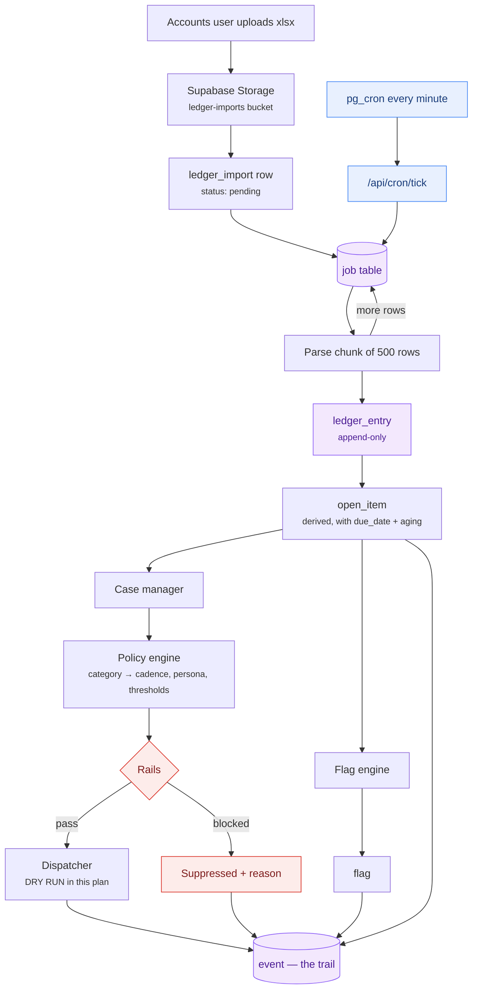

# 01 · Architecture

## Stack

| Layer | Choice |
|---|---|
| Framework | Next.js 15, App Router, TypeScript strict |
| Backend | Next.js Route Handlers under `app/api/` |
| Database | Supabase Postgres |
| Auth | Supabase Auth (email + password, staff only) |
| File storage | Supabase Storage, private bucket `ledger-imports` |
| Scheduling | Supabase `pg_cron` + `pg_net` calling `/api/cron/tick` |
| Hosting | Vercel — Preview (staging) and Production |
| UI | Tailwind + shadcn/ui |

## Three constraints this stack imposes

The business plan assumed a long-running server process. Vercel has none. These three
adaptations are the consequence, and every task below inherits them.

### 1. There is no background worker, so the database is the queue

Vercel functions run only while handling a request. There is nowhere for a daemon to
live. So: a `job` table holds the work, and a cron tick drains it.

`pg_cron` inside Supabase fires every minute and uses `pg_net` to POST to
`/api/cron/tick` with a shared secret. The handler claims a bounded batch of due jobs
with `FOR UPDATE SKIP LOCKED`, processes them within the function time limit, and
returns. Anything unfinished is picked up on the next tick.

Supabase `pg_cron` is chosen over Vercel Cron deliberately: Vercel's per-minute cron
frequency requires a paid plan, and putting the scheduler next to the data means the
schedule survives a hosting change. Vercel Cron is the documented fallback (D-04).

**Every job handler must be idempotent.** A tick can time out after doing work but
before marking the job done, and the next tick will retry it. For outreach this is
not a tolerable ambiguity — a retried send is a duplicate message to a client — so
`outreach.idempotency_key` is `UNIQUE` and the insert happens before the send.

### 2. Function time limits mean the import is chunked

A Vercel function has a hard execution ceiling (10s Hobby, 60s Pro by default). One
client produced 107 rows over 11 days; a full monthly multi-client import will not
parse and insert inside that window.

So the upload path is: browser uploads the file to Supabase Storage → a `ledger_import`
row is created with status `pending` → a job is enqueued → the cron tick parses and
inserts in chunks of 500 rows, advancing a cursor, re-enqueueing itself until done.
The UI polls the import status. No parsing happens in the upload request.

### 3. There is no admin framework, so back-office screens are real work

A Django-style auto-admin does not exist here. Supabase Studio covers developers but
must never be the accounts team's interface — it has no validation, no audit trail and
no concept of the domain. Every screen the accounts team touches is a built screen,
and the task list budgets for that explicitly rather than discovering it later.

## Component map

| Component | Path | Owns |
|---|---|---|
| Import pipeline | `lib/ledger/` | Parsing, natural keys, chunked insert |
| Ledger engine | `lib/ledger/open-items.ts`, `aging.ts` | Deriving open items, allocation, aging |
| Policy engine | `lib/policy/resolve.ts` | Category → cadence, persona, thresholds |
| Rails | `lib/policy/rails.ts` | The single gate every send passes |
| Case manager | `lib/cases/state-machine.ts` | Case transitions |
| Dispatcher | `lib/outreach/dispatch.ts` | Channel adapters; dry-run in this plan |
| Flag engine | `lib/flags/rules.ts` | Threshold evaluation |
| Job queue | `lib/jobs/` | Claim, run, retry, dead-letter |
| Trail | `lib/events/` | Append-only event writes and reads |

## Data flow

## Environments

| | Supabase project | Vercel | Notes |
|---|---|---|---|
| Local | `supabase start` (Docker) | `npm run dev` | Migrations applied via `db reset`. Seeded fixtures. |
| Staging | **separate project** `recovery-staging` | Preview deploys | Synthetic clients only. Real client data never lands here. |
| Production | `recovery-prod` | Production | Restricted access. |

Two Supabase projects, not one with two schemas. Sharing a project means a staging bug
can write to production rows, and no amount of care reliably prevents that.

## Security model

- The **service role key** is server-only. It appears in Route Handlers and job
  handlers, never in a client component, never behind a `NEXT_PUBLIC_` name.
- **RLS is enabled on every table with no permissive policies.** The anon and
  authenticated keys therefore read nothing directly. All data access goes through
  Route Handlers that check the session and the user's role. This is simpler and
  harder to get wrong than modelling this domain's authorization in RLS policies,
  and RLS-on-with-no-policy means a leaked anon key exposes nothing (D-05).
- Authorization lives in `lib/auth/require-role.ts` and is applied per route.
- Webhook endpoints verify provider signatures before doing anything. They are
  scaffolded but inert in this plan.
