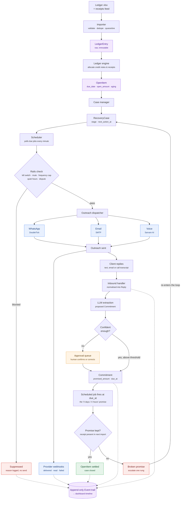
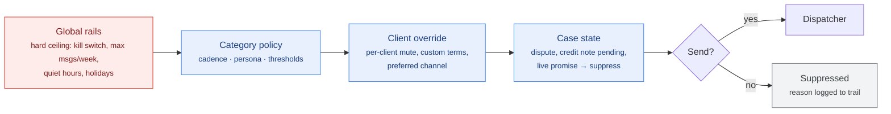

# Automated Receivables Recovery System — Project Plan

*Draft 28 Aug 2026 · Based on your brief plus analysis of `Olectra_Client_Ledger_Report.xlsx` · Assumptions marked ⚠ need confirming before anyone writes code*

---

## 0. What the sample file actually tells me

I profiled the ledger before planning, because the import format determines most of this project. Facts:

| Observation | Value |
|---|---|
| Issuer / client | VSAR Technologies Pvt. Ltd. → OLECTRA GREENTECH LIMITED `[OL000001]` |
| Period | 17/08/2026 – 27/08/2026 (11 days), generated 28/08 12:47 |
| Rows | 107 transaction rows + 1 `B/F` row + 1 totals row, 30 columns |
| Opening balance (`B/F`) | ₹51,30,687 |
| Closing balance | ₹66,97,661 |
| Net new billing in 11 days | ₹15,66,974 |
| Credit rows | 9 — all refunds / credit notes (`DR`, `DZ`, `BR` prefixes) |
| **Receipts / payments received** | **Zero** |
| Document prefixes | `DW` 74, `DS` 15, `MS` 6, `DR` 6, `DZ` 2, `IW` 2, `MW` 1, `BR` 1 |

Four things are missing from this file that a recovery system structurally requires:

1. **No due date and no credit terms.** Nothing in 30 columns says when any amount became payable. A dunning engine that doesn't know what is overdue can only do one of two things: chase everything, or chase nothing.
2. **No payments received.** Every negative row is a ticket refund or split-PNR credit note, not a receipt. If the import feed never carries receipts, the system can never mark anything recovered — it will keep chasing money that has already arrived. That is the single fastest way to lose a corporate account.
3. **No open-item view.** This is a running-balance statement, not an open-item aging list. You cannot tell which specific invoices are unpaid. The ₹51.3 lakh `B/F` is a single opaque number with no age — the largest figure on your future dashboard is the one you understand least.
4. **No client contact data.** `Emp Code` (Nitin Shende, Madhura Bhagat, Madhuri Ther) is *your* booking staff, not Olectra's accounts-payable contact. There is no phone number, no email, no named payer anywhere in the file. WhatsApp and voice both need an E.164 number that this file does not contain.

Two parsing traps I found, so the importer is built right the first time:

- **Multi-passenger invoices share one document code, with the bill amount on the first row only.** `DS26/2452`, `DS26/2453`, `DS26/2454`, `DS26/2472` each appear twice; the second row has a blank `Bill Amount`. Naive `GROUP BY doc_code, SUM(amount)` is fine; naive "one row = one invoice" is not. And `DS26/2472` shows ₹29,624 against a ₹14,576 fare because that one figure covers both passengers.
- **Refunds cross-reference their original via the `Remarks` column** (`DR26/554` ↔ `DW26/304720`). That linkage is what lets you net a credit note against the right invoice instead of against the balance blob. Preserve it.

**The consequence for planning:** the outreach machinery you described (WhatsApp, voice, email, promise tracking, re-trigger) is buildable and I've planned it below. But it sits on top of an open-item aging engine that does not exist yet and cannot be derived from this file alone. **That engine is the project.** The messaging is the easier half.

---

## 1. Problem and outcome

**Problem statement.** A travel agency bills corporate clients continuously — dozens of tickets, hotels and refunds per client per week — and money comes back slowly and unpredictably. Chasing it is manual: someone reads a statement, decides who is late, calls or messages a contact, is told "next week," writes it on paper or not at all, and forgets. Promises are never systematically followed up, no one can see the history of what was said to whom, and outstanding balances grow silently until they become a negotiation instead of a collection.

**Success metrics.** Pick two or three of these and hold the project to them:

1. **Reduction in DSO** (days sales outstanding) across enrolled clients — baseline it in week 1 or the project has no scoreboard.
2. **Zero incorrect chases.** No client is ever contacted about an amount they have already paid, disputed, or that carries a pending credit note. This is a quality gate, not an aspiration.
3. **100% of promises tracked.** Every commitment captured on any channel produces a scheduled follow-up that actually fires.
4. **Time saved:** hours per week the accounts team spends on manual chasing, before vs. after.

**Non-goals.** State these out loud now, because each one will try to get in:

- Not a reconciliation or accounting system. It reads your books; it is not your books.
- Not a replacement for your travel back-office ERP.
- Not a legal-recovery or arbitration workflow. It escalates to a human; humans handle disputes.
- Not a customer-service chatbot. It does not answer general client questions on WhatsApp.
- No automated payment collection or payment links in v1.
- Not multi-tenant SaaS for other agencies in v1. If that's the eventual ambition, say so now, because it changes the data model.

**Constraints.** ⚠ You haven't told me the three things that most change this plan — team, date, and volume. My working assumptions are in §2 and every estimate below is conditional on them.

---

## 2. Assumptions ⚠

Each of these is a real fork in the plan. Confirm or correct before Phase 1.

1. **Team: 2 developers, full-stack, plus you as product owner and one accounts person as the domain expert.** If it's one developer, multiply calendar time by ~1.8 and cut voice from scope. If the accounts person isn't available weekly, the aging rules will be guessed and wrong.
2. **Scale: 50–200 corporate clients.** Olectra alone produced 107 rows in 11 days, so at 100 similar clients that's roughly 10,000 ledger rows a fortnight and a few hundred outreach messages a week. That is small. **Do not let anyone architect for scale here** — a single application and one Postgres handles this for years. If the real number is 5,000 clients, tell me and the plan changes.
3. **Credit terms exist somewhere.** Contracts, the ERP's client master, or someone's memory. Recovery is undefined without them. If terms genuinely vary per booking, the aging engine gets materially harder.
4. **Receipts can be added to the import feed.** Either the ERP can export a receipts/payments ledger, or the import can accept a second file. **If this is impossible, stop and reconsider the project** — see §7.
5. **The ledger comes from a back-office system that could be read directly.** Excel import is the crutch, not the destination. §4 covers this.
6. **Contact data must be collected from scratch** — named AP contact, mobile in E.164, email, per client, with an escalation ladder (executive → AP manager → CFO office).
7. **DoubleTick account with a verified WABA either exists or takes 1–3 weeks to obtain.** ⚠ Verify today, not in month two.
8. **Sarvam AI's role.** ⚠ Confirm whether Sarvam provides outbound PSTN calling itself or only the voice-agent layer (STT/TTS/LLM) requiring a separate telephony provider (Exotel, Plivo, Twilio, Knowlarity). This is a hard prerequisite for Phase 4 and the answer is not obvious from the outside.
9. **You are the creditor collecting your own trade receivables**, not a third-party collection agency, and VSAR is not an RBI-regulated lender. That keeps you out of the Fair Practices Code regime — but not out of DPDP, TRAI, or Meta's policies (§8).
10. ⚠ **Is VSAR registered as an MSME?** If yes, the MSMED Act's 45-day payment rule and the Samadhaan portal are a genuine escalation lever and should be built into the escalation ladder's language. This materially strengthens your position against a large listed buyer.

---

## 3. Scope

### Must
- Ledger import from the exact file format above: idempotent, validating, per-client, with a rejected-rows report.
- **Open-item and aging engine** — invoices, credit notes, receipts, allocation, due dates, aging buckets.
- Client and contact master, with escalation ladder and per-contact channel consent.
- Case + dunning state machine with a scheduler.
- WhatsApp (DoubleTick) and email (SMTP) outreach with approved templates.
- **Inbound capture on both channels** — WhatsApp webhooks and email replies. Sending without receiving gives you no trail.
- Promise-to-pay capture with automatic re-trigger at the promised time.
- Append-only event trail per client, rendered as a chronological timeline.
- **Client categories** — assignable segments that drive every downstream behaviour (§5).
- **Cadence-as-data, per category** — notification frequency and channel sequence configured, not coded.
- **Threshold settings per category** — aging days, amount limits, message caps, promise grace period.
- **Flag engine with a red-alert board** — "pending debt from the past X months," threshold-driven, acknowledgeable.
- Dashboard: alert board, portfolio view (who owes what, how old), and client view with trail, notifications sent, replies, open items and commitments.
- Safety rails: global kill switch, per-client mute, frequency caps, quiet hours, dispute suppression, dry-run mode.
- **Cadence simulator** — before any category setting is saved, show what it would have sent against the last 30 days of real data.

### Should
- Voice calls via Sarvam with recording, transcript and disposition logged into the same trail.
- LLM extraction of promises and intent from free-text replies, with human confirmation.
- **Tone / persona per category** — salutation, register, language, signature, voice script style, escalation address.
- PDF statement / invoice attachment on outreach.
- Aging and collector-performance reports, exportable.
- Direct read from the back-office DB, replacing manual file upload.

### Later
- **Derived behaviour banding** — automatic category axis computed from payment history (needs receipts plus 2–3 months of data first).
- Payment links and auto-reconciliation of receipts.
- Multi-language templates (Hindi, Telugu, Marathi).
- Predictive scoring of who will pay late.
- Client self-service portal.
- Multi-tenant / other agencies.

### The walking skeleton

Thinnest end-to-end path, deployed to staging, in the first two weeks:

> Upload this exact `Olectra_Client_Ledger_Report.xlsx` through a web form → rows land in Postgres against client `OL000001` → a dashboard page shows the balance and a timeline with one entry ("ledger imported") → a scheduled job runs every minute and writes a **simulated** WhatsApp send into the trail → that appears on the timeline.

No real messages, no real aging. It proves import, persistence, scheduling, trail and deployment all connect. Everything after that is thickening this path.

---

## 4. Technology choices

**The rule that overrides everything below: whatever your two developers already ship confidently wins.** If they are a PHP shop, build this in Laravel and ignore my Django recommendation — a worse framework the team knows beats a better one they don't, on every real timeline. Here is my default and the reasoning, so you can overrule it where you know more than I do.

| Layer | Choice | Why | Rejected |
|---|---|---|---|
| Backend | **Django (Python)** | Finance-domain tabular work; `openpyxl`/`pandas` for import in the same language as the app; Django admin gives your accounts team a back-office for fixing bad rows for free, which is worth several weeks here | Node/NestJS — fine, but Excel/data handling is weaker and you'd add pandas-in-Python anyway; Laravel — equally fine *if* the team is PHP; FastAPI — no admin, no ORM conventions, you'd rebuild both |
| Database | **Postgres, single instance** | Ledgers, invoices, allocations and audit trails are relational; `JSONB` column stores the raw 30-column row verbatim for audit; handles reporting queries at this volume without a warehouse | MongoDB — money in a document store means eventual reconciliation pain; MySQL — acceptable, weaker JSONB and window functions |
| Scheduler | **Database-backed job table + one-minute cron poller**, Celery + Redis only if volume demands | This scheduler *is* the product — the promise re-trigger. A DB job table is inspectable with SQL, survives restarts, and an accounts person can see "next action at 3pm Tuesday" in the admin. Celery jobs vanish into Redis and are hell to debug | Celery/Redis from day one — real option, but adds a moving part before you need it; cloud cron/Lambda — scheduling logic lives outside your code and outside your audit trail |
| Frontend | **Django templates + HTMX + Alpine.js**, Chart.js for graphs | Dashboards, tables and timelines. Two devs, no separate frontend team, no mobile app | React SPA — doubles surface area and adds an API layer for tables and forms; you'd spend Phase 2 on plumbing |
| WhatsApp | **DoubleTick, behind a `WhatsAppProvider` interface** | Your choice, it's an established Indian BSP over Meta Cloud API. The interface matters more than the vendor: one file to swap to Gupshup, Interakt, or Meta Cloud API direct | Meta Cloud API direct — cheaper per message, but you own template management, webhook verification and WABA plumbing |
| Email | **Transactional provider (SES/Postmark/Sendgrid) for sending + dedicated mailbox with IMAP polling for replies** | **SMTP only sends.** To capture "we'll pay Friday" as a reply you need inbound: either the provider's inbound webhook or IMAP polling a `recovery@` mailbox. Thread with `Message-ID`/`In-Reply-To` so replies match to a case | Sending from a staff Office365 mailbox — fine at low volume and better reply rates, but throttles and gives no delivery events; capture replies via IMAP either way |
| Voice | **Sarvam AI + telephony provider, Phase 4** | Your choice; strong Indic STT/TTS matters for real AP staff in Hyderabad. ⚠ Confirm the PSTN question in Assumption 8 first | Twilio/Exotel bots alone — worse Indic handling; building voice in Phase 1 — see the novelty budget below |
| Reply understanding | **A hosted LLM with structured JSON output** (Claude/GPT/Sarvam for Indic), behind an interface, **human-confirmed** | Extracting "kindly share GST invoice first" vs. "paying in 3 days" vs. "already released, check your bank" is exactly the job LLMs do well and regex does terribly | Regex/keyword rules — brittle across Hinglish and polite Indian business email; fine-tuned model — no training data yet, revisit at 1,000 labelled replies |
| Hosting | **Managed PaaS or a single VM + Docker Compose**, in an India region | One app, one DB, one worker. Data residency for DPDP comfort | Kubernetes — a second product to maintain at this team size |
| Auth | Django's built-in auth + TOTP 2FA, or Google Workspace SSO | Internal tool, ~5–15 users, financial data | Hand-rolled auth — pure risk |

**Novelty budget: you're proposing to spend it three times over.** Sarvam voice agents, LLM promise extraction, and DoubleTick templates are all new to this team simultaneously. When something breaks you won't know which layer is lying. Sequence them one per phase (§6), never in parallel.

**Cheap to change later:** WhatsApp BSP, email provider, LLM vendor, hosting, charting library, dunning cadence rules.

**Effectively permanent:** the open-item data model, the event/audit trail schema, the case state machine, and the backend language. Spend your design time on the first two.

---

## 5. Architecture

One deployable application, one Postgres, one worker process. Nothing here justifies splitting.

### Components

- **Importer** — parses the ledger xlsx (and receipts feed), validates, upserts, quarantines bad rows.
- **Ledger engine** — derives open items from entries: allocates credit notes and receipts, computes due dates and aging.
- **Case manager** — the state machine. Opens, advances, suppresses and closes recovery cases.
- **Policy engine** — resolves a client's category into a cadence, a persona and a threshold set. The only place that answers "when do we contact this client next, on which channel, in what tone."
- **Scheduler** — polls due jobs each minute; the only thing that initiates outreach.
- **Outreach dispatcher** — channel adapters (WhatsApp / email / voice) behind one interface; enforces rails before any send.
- **Inbound handler** — WhatsApp webhooks, IMAP poll, call transcripts. Normalises everything into `Reply`.
- **Understanding layer** — LLM extraction → proposed `Commitment` → human confirm → schedules the re-trigger.
- **Flag engine** — evaluates threshold rules nightly and on every import; raises, re-raises and clears flags.
- **Dashboard** — alert board, portfolio view, client view with trail, settings, approval queue.
- **Audit trail** — append-only `Event` table. Every state change, send, delivery receipt, reply and human action writes here. This *is* your dashboard trail.

### Data flow (the core loop you described)

Every box in that diagram writes to the `Event` trail, not just the five dashed edges shown — those are drawn only to keep the diagram readable. The two loop-closing edges are the ones that matter most: `Z → G` is your "trigger again after X days," and the `X` decision is why the receipts feed in §2 Assumption 4 is a hard gate rather than a nice-to-have. Without it, that diamond can never answer "yes," and the loop never terminates.

### Categories, cadence and tone

**Use two axes, not one.** A single `category` field conflates two different questions and goes stale within a quarter.

- **Relationship tier** — human judgement, changes rarely. Suggested: `Strategic` / `Standard` / `Watchlist` / `New`. Set by you, with a reason recorded.
- **Behaviour band** — derived nightly from payment history. Suggested: `Prompt` / `Slipping` / `Chronic` / `Unknown`.

The effective category is the pair. Olectra is plausibly `Strategic × Chronic` at the same time — those pull in opposite directions, and you want that tension visible on the screen rather than averaged away into one label that someone has to interpret. Cadence resolves mostly off the band; tone and escalation address resolve mostly off the tier.

⚠ **The behaviour band cannot exist at launch.** Deriving it needs receipts (Assumption 4) plus two or three months of history in the system. Ship with tiers only, every client banded `Unknown`, and turn the derived axis on in Phase 6. Building the derivation in Phase 2 means writing an algorithm against data that does not yet exist and cannot be tested.

**Cadence is data, not code.** Your accounts team will want to tune this weekly, and every tuning cycle that requires a developer is a cycle that doesn't happen. Illustrative defaults only — ⚠ your accounts lead sets the real ones:

| Category | Step 1 | Step 2 | Step 3 | Step 4 | Hard cap |
|---|---|---|---|---|---|
| Strategic × any | Email, due+3d | WhatsApp, due+10d | Email to AP manager, due+20d | Human call (not the bot), due+30d | 1 / week |
| Standard × Prompt | WhatsApp, due+2d | Email, due+9d | WhatsApp, due+18d | Escalate to AP manager, due+28d | 2 / week |
| Standard × Slipping | WhatsApp, due+1d | Email, due+5d | Voice, due+12d | Escalate, due+21d | 2 / week |
| Watchlist × Chronic | WhatsApp, due+0d | Voice, due+3d | Email to CFO office, due+8d | Human review + legal decision, due+15d | 3 / week |
| New | Email, due+5d (softer, relationship-building) | WhatsApp, due+14d | Email, due+25d | Escalate, due+35d | 1 / week |

**Resolution order.** Narrower scopes may only make the system *quieter*, never louder than the global ceiling. That single rule is what stops a mis-set category from becoming a client-facing incident:

**Tone and persona — with the constraint that will surprise you.** A persona bundles: salutation style, register, language, signature block, escalation address, voice script style, and the LLM system prompt used for free-text replies.

You can vary tone freely in **email bodies**, **voice scripts**, and **WhatsApp messages sent inside the 24-hour service window** after a client replies. You cannot vary it freely in **WhatsApp business-initiated templates** — those are fixed pre-approved strings with variable slots. Varying tone per category there means a separate approved template for every *(category × stage)* pair: four categories by four stages is sixteen templates through Meta review, each independently rejectable, each needing re-approval when you reword it.

My recommendation: **keep WhatsApp templates tone-neutral and factual across all categories** — invoice number, amount, due date, request to confirm status — and put your persona variation into email and voice, where you own the words outright. That collapses sixteen templates to four, and it lowers your Meta policy risk at the same time, since neutral factual templates are the ones that survive review.

Cap the tone ladder at three rungs: `Courteous` / `Neutral` / `Firm`. There is no fourth. Anything past Firm is a human writing a letter on letterhead, not a system sending a message. Get the Firm templates legal-reviewed once, and **never let tone escalate past Neutral automatically** — that step requires a human tick. An automated system that grows progressively ruder at a listed client, unsupervised, is a headline rather than a feature.

### Dashboard screens

1. **Alert board (home).** Red flags first, then amber, then the normal portfolio table. Each flag row: client, amount, age, which rule fired, owner, Acknowledge button.
2. **Client detail.** Header carries name, code, both category badges, total open, an aging strip, active flags, and the mute switch. Then tabs:
   - **Trail** — the unified chronological timeline. Every outbound message with delivery/read/failed status, every reply in full text or transcript, every promise made, kept or broken, every case state change, every human action, and every settings change that affected this client. One stream, filterable by channel and date. This is a rendered query over the `Event` table and nothing more, which is exactly why the append-only rule in §5 matters.
   - **Notifications** — outbound only, in table form, with channel, template, status, cost and timestamps.
   - **Replies** — inbound only, each with its extracted commitment and the model's confidence score.
   - **Open items** — invoices, aging, credit notes, disputes.
   - **Commitments** — promises and their outcomes, with a kept-rate figure that feeds the behaviour band later.
3. **Settings → Categories.** Define tiers, bulk-assign clients, and per category set the cadence table, the persona, and the threshold set.
4. **Cadence simulator.** Before any category setting saves, show the effect against the last 30 days of real data: *"this policy would have sent 214 messages instead of 63, touching 41 clients, 9 of them Strategic."* Treat this as non-negotiable rather than a nicety. Someone will eventually type `6` into a field meaning days while the unit is hours, and this screen is the only thing standing between that typo and your client list.

Every settings change writes to the audit trail with who, when, and the old and new values. When outreach volume triples one Tuesday, that log is how you find out why in two minutes instead of two days.

### Flags and alerts

Rules the flag engine evaluates, each with its threshold set per category:

| Flag | Fires when | Typical severity |
|---|---|---|
| **Aged debt** | An open item exceeds the category's `red_days` / `amber_days` | Red — *"Pending debt from the past X months"* |
| **Amount exposure** | Total open above the category's amount threshold | Red |
| **Broken promise** | A commitment passes `due_at` plus grace with no receipt | Red |
| **Silence** | N consecutive outreach attempts with zero reply on any channel | Amber |
| **Adverse trajectory** | Balance grew by X% while nothing was received in N days | Amber |
| **Unaged balance** | A brought-forward blob with no invoice-level breakdown | Grey — needs data, not chasing |

Four design rules that decide whether this feature is used or ignored after month two:

- **No modal popups.** You asked for a popup, and I'd push back on that specific form. Modals get dismissed reflexively within a week, and once dismissed the information is gone with no record that anyone saw it. Use a persistent red banner on the client header, the alert board as the landing page, and an optional daily digest email. The signal survives; the interruption doesn't.
- **Acknowledge is not resolve.** Acknowledging silences a flag for a set period and requires a reason, which is logged. A flag resolves only when the underlying condition clears — usually a receipt landing in the next import.
- **Cap the reds.** If more than roughly ten flags are red at once, the thresholds are miscalibrated, not the portfolio. Have the board say so. A screen that is entirely red conveys exactly as much information as a screen that is entirely white.
- **Set thresholds from your actual aging distribution, not from round numbers.** If 60% of your book is already 90+ days, a 90-day red threshold lights up everything on day one and the team learns to ignore the colour. Pull the real distribution first (§9), then pick thresholds that flag the worst decile.

One unavoidable interaction: **the ₹51.3 lakh brought-forward balance has no age**, so the aged-debt rule cannot evaluate it. It will either never fire or always fire depending on how you handle nulls, and both are wrong. Give it its own grey flag — *"unaged balance, breakdown required"* — that routes to a data task rather than a collection action. Pretending it's 90 days old to make the dashboard look complete would be the worst available choice.

### Data model sketch

Core entities; the ones marked **★** are expensive to get wrong.

- `Client` — code (`OL000001`), name, cost center, **credit_terms_days**, **relationship_tier**, **behaviour_band** (derived, nullable), escalation policy, mute flags, assigned collector
- **★** `Category` — tier, band, display name, is_default. The join key for every policy below
- **★** `CadencePolicy` — category, ordered `CadenceStep` rows (sequence, channel, offset_days_from_due, template, persona, escalation_level), hard cap per week
- `Persona` — category, tone (`courteous`/`neutral`/`firm`), salutation, language, signature, voice_script_style, llm_system_prompt, requires_human_approval flag
- **★** `ThresholdSet` — category, amber_days, red_days, amber_amount, red_amount, max_messages_per_week, quiet_hours, promise_grace_hours, silence_attempts
- `Flag` — client, open_item (nullable), rule, severity, raised_at, acknowledged_by, acknowledged_at, ack_reason, ack_until, resolved_at, resolution
- `SettingChange` — actor, scope (category/client/global), field, old_value, new_value, changed_at, reason
- `Contact` — client, name, role, `phone_e164`, email, channel consents, escalation_level, is_primary
- `LedgerImport` — file, sha256, client, period_from/to, row counts, status, uploaded_by
- **★** `LedgerEntry` — import, client, doc_date, doc_code, narration, pax_name, reference, airline, ticket_no, pnr, bill_amount, entry_type (`debit`/`credit`/`opening`), `raw_row JSONB`, **natural_key** (unique: client + doc_code + doc_date + amount hash) for idempotent re-import
- **★** `OpenItem` — client, source_ref, issue_date, **due_date**, gross_amount, credits_applied, receipts_applied, open_amount, aging_bucket, status (`open` / `part_paid` / `settled` / `disputed` / `written_off`). The `B/F` becomes one synthetic open item flagged `aging_unknown` — visibly, so nobody mistakes it for aged data.
- `Receipt` — client, date, amount, instrument, ref, `Allocation` rows linking to OpenItems
- `RecoveryCase` — client, stage, status, total_open, `next_action_at`, assigned_to, suppressed_until, suppression_reason
- `DunningRule` — stage, channel sequence, wait interval, template, escalation target (data, not code — your accounts team will want to tune this weekly)
- `Outreach` — case, contact, channel, direction, template, rendered body, provider_message_id, status (`queued`→`sent`→`delivered`→`read`/`failed`), cost, sent_at
- `Reply` — case, outreach (nullable — clients reply out of band), channel, raw_text, received_at, `CallSession` link
- **★** `Commitment` — case, reply, promised_amount, promised_on, **due_at**, confidence, extraction_model, confirmed_by, status (`pending` / `kept` / `partial` / `broken`)
- `CallSession` — case, provider_call_id, duration, recording_url, transcript, disposition, consent_captured
- **★** `Event` — append-only: case, actor (system/user/client), type, payload JSONB, occurred_at. Never updated, never deleted.

### Cross-cutting

- **Environments:** local → staging (with anonymised or synthetic client data and *stubbed* providers) → production. Provider stubs in staging are non-negotiable; the first accidental live WhatsApp blast to a real client is unrecoverable.
- **Secrets** in the platform's secret store, never in the repo. Provider keys can spend money.
- **Observability:** every provider call logged with request id; alerts on failed sends, scheduler stalls (no job processed in 10 min), and import failures.
- **Backups:** nightly Postgres dump, and a restore actually rehearsed once in Phase 5. An untested backup is a rumour.
- **Immutability:** `LedgerEntry` and `Event` are append-only. Corrections create new rows. This is a money system; you will one day need to prove what you sent and why.

---

## 6. Roadmap

Assumes 2 developers at roughly 60–70% of their time on planned work (the rest goes to meetings, review, support, interruption). Calendar weeks, ranges only.

| Phase | Outcome someone can demo | Estimate | Confidence |
|---|---|---|---|
| **0 · Skeleton + external unblocking** | This exact xlsx uploads on staging; rows visible against `OL000001`; a simulated send appears on the timeline. **WhatsApp templates submitted to Meta. Sarvam/telephony accounts requested.** | 1–2 wks | High |
| **1 · Open-item & aging engine** | Accounts person looks at the screen and agrees: "yes, that's what Olectra owes, and yes, ₹X is 60+ days old." Credit notes netted against originals. Receipts allocating. | 3–5 wks | **Low** — depends entirely on Assumptions 3 & 4 |
| **2 · Categories, cadence, thresholds, flags, dry run** | Accounts lead assigns Olectra to a category in the UI, edits that category's cadence, sees the simulator say what it would have sent, and watches the flag board light up on real aging. Cases open automatically; a week of logged-but-unsent outreach. Kill switch and caps demonstrated. | 4–6 wks | Medium |
| **3 · WhatsApp + email live, with inbound and personas** | A real message reaches one pilot client in that category's tone; their reply lands in the trail with delivery and read status. Client detail tabs complete. | 3–5 wks | Medium — template approval is the variable |
| **4 · Promise capture + re-trigger** | Client says "3 days"; the extracted promise appears in an approval queue; a human confirms; the follow-up fires 3 days later and shows on the timeline. | 2–4 wks | Medium |
| **5 · Voice via Sarvam** | An outbound call happens, the recording and transcript are on the timeline, and a promise extracted from speech schedules a follow-up. | 3–5 wks | **Low** — until Assumption 8 is answered |
| **6 · Behaviour banding, hardening, rollout** | Bands compute automatically from three months of payment history; rolled out to all clients; aging report matches the ERP to the rupee; backup restore rehearsed; runbook written. | 3–5 wks | Medium |

**Total: 19–32 calendar weeks (roughly 5–8 months) for 2 developers.**

**The four additions cost roughly 4–6 weeks**, up from 15–26. Most of that lands in Phase 2, and most of *that* is not the categorisation logic — which is straightforward — but the settings UI, the simulator, and the flag board, because configuration screens with real consequences need more care than the engines behind them. The persona work in Phase 3 is small in code and large in Meta template submissions, which is calendar time rather than effort.

**That range is wide on purpose and I'm not going to narrow it for you before Phase 1 lands.** The width lives almost entirely in Phase 1 — I don't know how dirty your credit-terms data is or whether receipts can be exported. Two days spent profiling a full year of ledger and receipts data in week 1 would let me halve that range.

**Explicit buffer:** 15% on top of the above for integration friction and rework, stated openly rather than hidden inside tasks. Hidden buffer gets negotiated away by people who don't know it's there.

### Critical path

**Phase 1 gates everything.** The outreach engine can be built in parallel but cannot go live without correct open items, because launching it on wrong numbers is worse than not launching. Meanwhile, two things must start in **week 1** regardless of code progress:

1. **WhatsApp template submission.** Meta review is calendar time you do not control, and collections-flavoured templates get rejected or reclassified. Submit early, iterate on rejections while building.
2. **The credit-terms and receipts conversation** with your accounts team and ERP vendor. This is a data-and-people question, and it is the actual long-lead item.

If you want something useful in six weeks rather than five months, the honest cut is: **Phase 0 + 1 + 2, plus manual sends from a "who to chase today, with a pre-drafted message" screen.** No automation, no voice, no promise extraction. That is genuinely valuable on its own — it beats a spreadsheet immediately — and it de-risks everything after it, because you'll have real message drafts and real replies to design the automation against.

---

## 7. Risks

| Risk | Likelihood | Impact | Early warning | Mitigation | Owner |
|---|---|---|---|---|---|
| Credit terms don't exist as data; due dates can't be computed | **High** | Project blocked; aging is guesswork | Nobody can answer "when was invoice X due" in week 1 | Agree a documented fallback (e.g. 30 days from doc date, overridable per client) and get it signed off by whoever owns the client relationships | You |
| Receipts feed unavailable; system chases paid invoices | **High** | Client relationship damage; project shut down | The ERP vendor can't produce a receipts export in week 2 | Manual receipt entry screen as a stopgap; hard rule that no case advances without a receipts import inside 48h | Accounts lead |
| WhatsApp templates rejected or reclassified by Meta | Medium | Primary channel unavailable | First submission bounces | Submit in week 1; keep language transactional and factual (invoice number, amount, date) with no pressure language; email as a working fallback | Dev 1 |
| The ₹51L opening balance is unaged and undisputable | **High** (it already is) | You cannot credibly dun the largest number you have | Already true in the sample file | Get a one-time full open-item extract from the ERP, not a period statement. Treat B/F separately in the UI until it's broken down | You |
| Sarvam requires separate telephony you haven't procured | Medium | Phase 5 slips by weeks | No clear answer from Sarvam in week 2 | Answer Assumption 8 now; treat Phase 5 as optional scope until then | Dev 2 |
| LLM mis-extracts a promise and the system chases early or late | Medium | Embarrassment with a client | First 20 extractions reviewed and >2 are wrong | Human confirmation mandatory until measured accuracy over 100 real replies justifies removing it. Never auto-act on low confidence | Dev 1 |
| Automated calls annoy a large corporate's AP team | Medium | Loss of a client worth far more than the receivable | Any complaint from any client contact | Quiet hours, frequency caps, per-client opt-out, voice only for the aged tail, and never for a client under active negotiation | You |
| Alert fatigue: everything is red, so nothing is | **High** | The flag board is ignored by month two, and a real red flag is missed | More than ~10 reds standing for a week, or nobody acknowledging any of them | Set thresholds from the real aging distribution, cap and warn on excess reds, require a reason on every acknowledgement, review threshold calibration monthly | Accounts lead |
| Per-category tone multiplies WhatsApp templates through Meta review | Medium | Phase 3 slips by weeks per rejection round | The template count in the submission plan exceeds ~6 | Keep WhatsApp templates tone-neutral across all categories; vary persona only in email and voice | Dev 1 |
| Categories assigned once and never revisited | **High** | Cadence and tone drift out of sync with reality; a Strategic client gets Watchlist treatment | Category last-changed dates older than 6 months across most of the book | Show the last-changed date on the client header; quarterly review task; ship the derived behaviour band in Phase 6 so at least one axis self-maintains | You |
| A mis-set cadence blasts clients | Medium | Multiple client complaints in one day, possibly a WABA quality-rating hit | Simulator shows a large jump and someone saves anyway | Simulator mandatory before save, global weekly cap that category settings cannot exceed, settings changes audited with the actor named | Dev 1 |
| Category change retroactively re-fires the ladder | Medium | A client gets four messages in an hour | Any recategorisation during the dry run producing backdated jobs | Category changes affect forward scheduling only; never recompute past steps. Test this explicitly in Phase 2 | Dev 2 |
| Scope creeps into reconciliation | **High** | Timeline doubles | Requests like "can it also match bank statements" | The non-goals list in §1, pointed at in writing | You |
| Excel-file dependency; imports forgotten or stale | Medium | Dashboard silently wrong | Any gap of >2 days between imports | Alert on stale data; pursue direct ERP DB read from Phase 2 | Dev 2 |
| Nobody owns escalation | Medium | Automation escalates into a void | Escalated cases sitting untouched >7 days | Named collector per client, in the data model, with an aging report on unactioned escalations | You |

### What would kill this project

1. **Launching on wrong numbers.** Not a technical failure — a data one. One automated WhatsApp to Olectra's finance head about ₹12 lakh they paid last Tuesday, and this project is over, regardless of how well it's built. Everything in §5's rails and the Phase 2 dry run exists to prevent exactly this.
2. **The receipts gap never closing.** If the ledger feed structurally cannot carry payments received, the system cannot know when to stop. Escalating a paid invoice is not a bug you apologise for; it's the one that gets the tool banned internally. If Assumption 4 turns out false, **do not build the automation** — build the "who to chase today" screen and keep a human in the loop permanently.
3. **Building the voice bot first.** It's the most impressive demo and the least valuable component. It also carries the most unknowns — telephony procurement, Indic ASR accuracy on a noisy AP-desk line, consent, TRAI. Built in month one, it eats the schedule and teaches you nothing about whether the core loop works.
4. **Diagnosing the wrong problem.** Olectra is a listed company. Large corporates rarely pay late because they're unwilling — they pay late because of process friction: invoice not entered in their ERP, missing PO or cost-center reference, GST invoice copy not attached, approver on leave, mismatch between your statement and their ledger. If that's your actual situation, then **the highest-ROI feature is not the dunning cadence at all** — it's attaching the invoice and a reconciliation summary to a message aimed at a correctly-named person, and tracking which internal blocker each unpaid item is stuck behind. I'd spend one afternoon with your accounts team asking "why didn't this specific invoice get paid" across twenty real cases before committing to a cadence design. The answers will change what you build.
5. **Three novel integrations at once.** Covered in §4. It shows up as a month where nothing works and nobody can say why.

---

## 8. Operating plan

**Definition of done** for anything shipping: tests on the money paths (import idempotency, allocation, aging, scheduler firing) · code reviewed · works in staging against stubbed providers · monitored and alerting · a runbook line for the accounts team.

**Cadence.** Weekly demo to you and the accounts person — every phase in §6 has a demonstrable outcome specifically so this meeting has something real to look at, not a status update. Daily standup between the two devs. Retro after each phase.

**Testing, proportionate to blast radius.** Ruthless on: allocation arithmetic, aging boundaries, idempotent re-import, scheduler firing exactly once, and the suppression rails. Light on: dashboard layout. A double-send bug costs a client; a misaligned table doesn't.

**The dry run is your most valuable single de-risking step.** Two weeks of full production behaviour with the dispatcher writing to the trail instead of the network. Then a pilot on **one internal or friendly client** for another two weeks. Then three clients. Then the rest. Any faster and you're testing on relationships.

**Rollback.** Feature-flag every channel independently. The global kill switch stops all outreach in one click, and it should be visible on the dashboard header, not buried in an admin page.

**Security and compliance** — none of this is phase two:

- **DPDP Act 2023.** You'll hold names, mobiles, emails and call recordings of identifiable individuals. Purpose limitation, a retention period on recordings and transcripts, a deletion path, and a documented notice/consent basis for contacting AP staff. Get an hour of real legal advice; I'm flagging the surface, not clearing it.
- **Call recording consent** — announced at call start, and the fact of it logged on the `CallSession`.
- **TRAI / DND** on automated outbound voice. Transactional B2B calls under an existing commercial relationship are a different category from telemarketing, but the boundary is worth a lawyer's opinion before you dial at volume.
- **Meta's business messaging policy.** Debt-collection content is sensitive. Keep templates factual — invoice number, amount, date, a request to confirm status. No pressure, no threats, no urgency language. This protects both your WABA and your client relationships.
- Access control: not everyone who sees the dashboard should be able to send a message or mute a client. Audit every human action into `Event`.

**Cost.** I'm not going to invent numbers. Get written quotes and model them at projected volume, not today's:

`(clients × messages/client/month × per-conversation WhatsApp rate) + DoubleTick subscription + email provider + (calls/month × minutes × [Sarvam per-minute + telephony per-minute]) + (replies/month × LLM per-call) + hosting + Postgres backups`

Two specifics to check: **WhatsApp is priced per message/conversation by category, and India rates have changed more than once** — quote it fresh. And **voice is your dominant variable cost per contact**, by an order of magnitude over WhatsApp, which is another reason it belongs on the aged tail rather than the routine cadence.

**Decision log.** One markdown file in the repo. Every architectural decision gets date, decision, reasoning, alternatives rejected. The reasoning is what the next maintainer needs; the decision alone is all they'll get without it.

**Drift watch-list** — check these monthly: milestones hit on date but not on demonstrable outcome · the same task "90% done" for three weeks · Phase 1 estimate revised upward twice · integration or the dry run postponed to a later phase · decisions being reopened rather than made.

---

## 9. Start here

Concrete enough to begin Monday.

1. **Ask your ERP vendor two questions, in writing:** (a) can it export an *open-item outstanding* report — invoice, date, due date, amount, amount received, balance — rather than a period statement? (b) can it export receipts/payments, or give read-only DB access? Nothing else on this list matters as much.
2. **Sit with your accounts person for one hour** and answer: what are the credit terms per client, where are they recorded, and take twenty currently-unpaid invoices and write down *why* each one hasn't been paid. That list is the real product requirement.
3. **Get the ₹51.3 lakh broken down.** A one-time aged open-item extract for Olectra. Until that exists, your biggest number is unusable.
4. **Define your categories on paper this week, before any UI exists.** Name three or four tiers, write one sentence on what qualifies a client for each, sort your top twenty clients into them by hand, and note which tier Olectra belongs in and why. If that exercise is hard to do on paper, the software will not make it easier — it will just hide the disagreement.
5. **Pull your actual aging distribution** — how much of your total book sits at 0–30, 31–60, 61–90 and 90+ days. Set your red and amber thresholds from that curve so the flag board highlights the worst decile rather than the whole page. This is fifteen minutes of SQL or Excel and it determines whether anyone trusts the alerts.
6. **Confirm the DoubleTick account status** — WABA verified, business verified, template API access, and who at your end can submit templates.
7. **Email Sarvam AI** and ask directly whether they provide outbound PSTN calling or require a telephony partner, and what Indic ASR accuracy they'll commit to on a phone-quality line.
8. **Draft four WhatsApp templates and submit them to Meta this week** — a first reminder, a promise follow-up, an escalation notice, and a statement-attached nudge. Factual, transactional, tone-neutral, no pressure language, and deliberately not category-specific. Rejections are information; get them early.
9. **Create the repo.** CI running an empty test suite, Django + Postgres in Docker Compose, a hello-world deployed to staging that you can reach from a browser.
10. **Build the importer against this exact file** as the first real code, with a test asserting: 107 transaction rows parsed, opening ₹51,30,687, closing ₹66,97,661, the four duplicate-code multi-pax invoices handled, the nine credit notes linked to their originals via `Remarks`, and re-importing the same file twice changing nothing.
11. **Baseline your DSO today.** Without it, you cannot prove in six months that any of this worked.

---

*Estimates are ranges, not commitments, and the Phase 1 range will stay wide until step 1 and step 2 of §9 are done. Everything marked ⚠ is a guess I made so you'd have a plan to argue with — correct them and I'll revise.*
